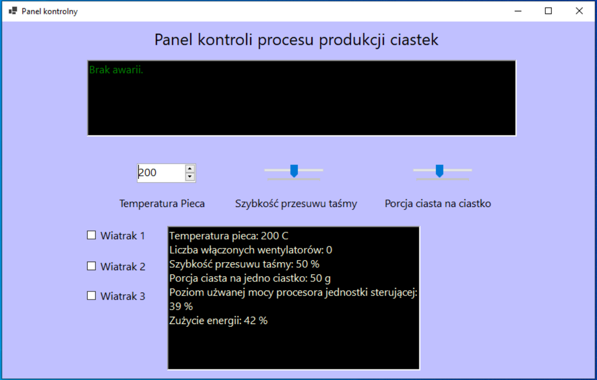

# Production Line

## Overview
The application simulates the operation of the dispatching station of a production line baking cakes.

## Environment
The program is written in C# .NET Framework 6.0 in the Visual Studio 2022 environment.

## Description

The subject of the selected application is an application that simulates the position of a dispatcher of a cookie production line. The program includes elements of diagnostics of the supervised production process of cookies as well as self-diagnostics of the operator overseeing the correct course of production. A login panel is available. After logging in, current production process parameters and a control panel with the ability to change oven temperature, turn fans on/off, change belt speed and change dough weight per serving are visible. The panel displaying production parameters includes those directly set by the user, as well as the "energy" consumption of the production line eyes the CPU consumption read from the real unit used. Periodically, a form appears in which you must confirm your presence. A random failure system is implemented in the program. If a failure is not corrected or activity is not confirmed, the user is logged out of the system and the program terminates.

## Interfejs Opis

The setting of the cake portion size and the speed of the belt travel was realized by TrackBar sliders, the position of which changes these parameters. For both, the minimum value is 10, and the maximum is 100. Change from the user level is possible in increments of 10.
Temperature control change is possible in the range of 150-300ºC. By default, the oven temperature is set to 200ºC. The temperature is changed by pressing the up or down arrow. One press on the arrow increases or decreases the oven temperature by 10ºC.
Each fan has its own checkbox, which can be in true state - the fan is on or false - the fan is off. Pressing it changes its state to the opposite. Fans in the program increase the energy consumption of the line, and can be activated/deactivated by random jittering of the line.
The user is required to confirm activity every 60 seconds.

